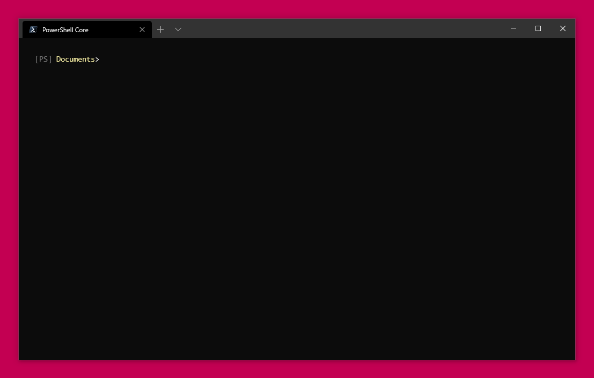

### [PowerShell profile](Documents\PowerShell\Microsoft.PowerShell_profile.ps1)
Contains small PowerShell functions to:
- Invoke **Visual Studio** from the command line without manipulating the PATH
- Quickly and efficiently stage changed Windows configuration files to git repo using a trick borrowed from 
Linux [ **dotfiles** ](https://github.com/jasper-zanjani/dotfiles)

Check out my PowerShell prompt!

